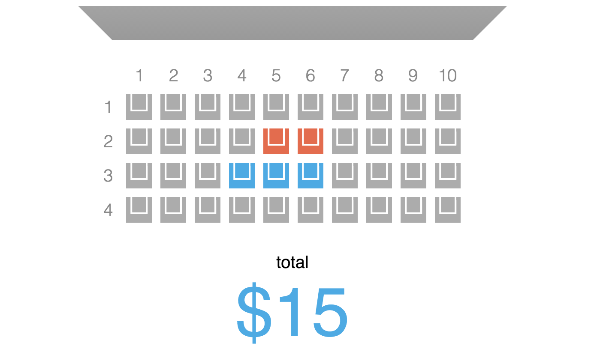

Example React application built with [React Horizon connector](https://github.com/roman01la/react-horizon) to horizon.io realtime backend.

It is a simple movie tickets online booking application which allows you to see seats availibility in realtime.

## How to run
1. Make sure you have installed RethinkDB and Horizon's CLI
2. Clone this repository
3. Install dependencies `$ npm i`
4. Start React application build `$ npm start`
5. Start Horizon server by executing the following command in `server` directory `$ hz serve --dev`
6. Open [http://127.0.0.1:8181](http://127.0.0.1:8181) in multiple tabs in your browser
7. Call `generateSeats()` function in browser's console to fill in datatbase table with initial data
